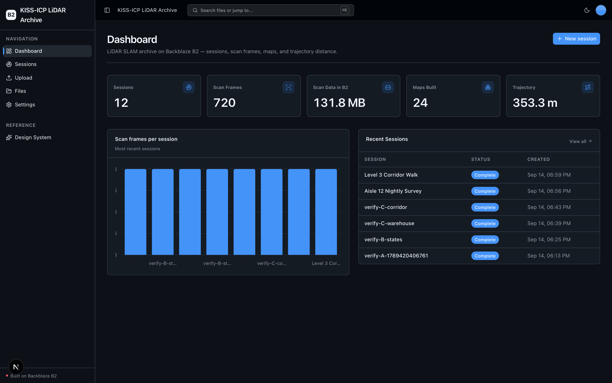
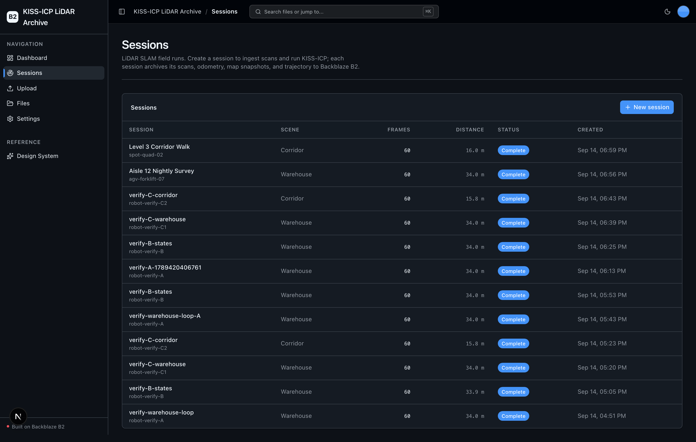
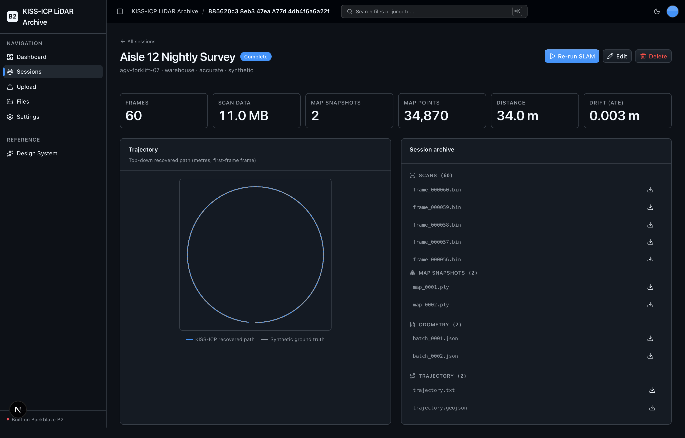
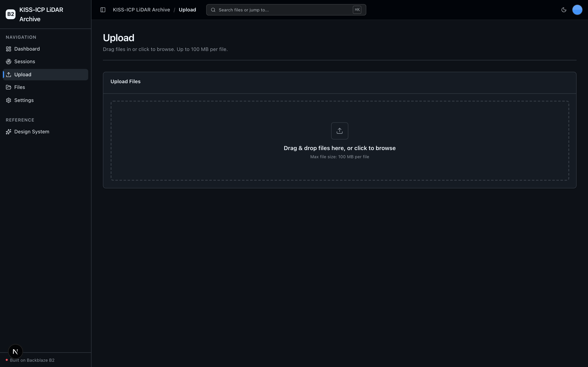

<!-- last_verified: 2026-09-14 -->
# KISS-ICP LiDAR Archive

A B2 sample for robotics and autonomous-vehicle teams running continuous **LiDAR
SLAM**. It ingests LiDAR scan frames, runs **[KISS-ICP](https://github.com/PRBonn/kiss-icp)**
(the real open-source engine, locally on the backend) for odometry and incremental
mapping, and streams every artifact — raw scans, per-batch odometry, incremental
`.ply` map snapshots, and the session trajectory — into
**[Backblaze B2](https://www.backblaze.com/sign-up/ai-cloud-storage?utm_source=github&utm_medium=referral&utm_campaign=ai_artifacts&utm_content=b2ai-kiss-icp-lidar-archive)**
over the S3-compatible API. The result is a cheap, growing archive of SLAM output
for offline analysis and model retraining.

The headline capability runs on **local OSS only** — KISS-ICP is CPU-only and
needs no second API key. The only credentials are your `B2_*` values.

**What you get out of the box:**
- LiDAR **session** management — create, run, browse, edit, and delete SLAM runs
- Real **KISS-ICP** odometry + incremental voxel-hash mapping on the backend (CPU-only)
- A synthetic LiDAR scan generator (no sensor required) with a known ground-truth path
- Every scan, pose, map snapshot, and trajectory archived to Backblaze B2
- A 2D trajectory plot, a session-scoped archive explorer, and a full-bucket File Explorer
- FastAPI backend with a strict layered architecture and structural tests
- Agent-optimized docs — your AI coding agent can read the repo and start contributing immediately

## What it looks like

**Dashboard** — SLAM archive metrics (sessions, scan frames, scan data in B2, maps, trajectory distance), a scan-frames-per-session chart, and recent sessions.



**Sessions** — every LiDAR SLAM run with its robot, scene, frame count, trajectory distance, and status.



**Session detail** — per-run metrics, the KISS-ICP recovered path against synthetic ground truth, and the B2-archived scans, map snapshots, odometry, and trajectory.



**Upload** — drag-and-drop files straight into the B2 bucket over the S3-compatible API.



## Quick Start

You need: Node.js >= 20, pnpm >= 9, Python >= 3.12, and a free **[Backblaze B2 account](https://www.backblaze.com/sign-up/ai-cloud-storage?utm_source=github&utm_medium=referral&utm_campaign=ai_artifacts&utm_content=b2ai-kiss-icp-lidar-archive)**.

### Setup

**1. Run setup**

```bash
pnpm run setup
```

This copies `.env.example` to `.env` only when `.env` does not already exist,
installs workspace dependencies from `pnpm-lock.yaml`, creates
`services/api/.venv` if missing, validates that an existing venv uses Python
3.12+, and installs the API's committed Python 3.12 resolution (including
`kiss-icp`) from `services/api/requirements.lock`. It is safe to rerun and never
overwrites an existing `.env`.

> Use the `pnpm run` form: `setup` (like `doctor`) is a built-in pnpm command
> before pnpm 11, so bare `pnpm setup` would run pnpm's own command instead of
> this script.

**2. Add your B2 credentials**

Open `.env` in your editor and keep it visible. Then head to the [Backblaze B2 dashboard](https://secure.backblaze.com/b2_buckets.htm?utm_source=github&utm_medium=referral&utm_campaign=ai_artifacts&utm_content=b2ai-kiss-icp-lidar-archive) and:

1. **Create a bucket.** Paste each value into `.env`:
   - **Bucket Unique Name** → `B2_BUCKET_NAME`
   - The region embedded in the bucket's S3 endpoint (e.g. `us-west-004`) → `B2_REGION`
2. **Create an application key** with `Read and Write` permission. Paste each into `.env`:
   - **keyID** → `B2_APPLICATION_KEY_ID`
   - **applicationKey** → `B2_APPLICATION_KEY` *(only shown once — paste it now)*

The S3 endpoint is derived from `B2_REGION` as `https://s3.<B2_REGION>.backblazeb2.com`.

> Want a walkthrough? See the docs for [creating a bucket](https://www.backblaze.com/docs/cloud-storage-create-and-manage-buckets) and [creating app keys](https://www.backblaze.com/docs/cloud-storage-create-and-manage-app-keys).

**3. Run it**

```bash
pnpm dev
```

Frontend at `localhost:3000`, API at `localhost:8000`. Open **Sessions**, create a
synthetic session, watch it ingest scans, then hit **Run SLAM** — KISS-ICP builds
odometry, a `.ply` map, and a trajectory, all archived to B2. Interactive API
docs (Swagger UI) are at `localhost:8000/docs`, with ReDoc at `/redoc`.

`pnpm dev` runs the preflight check first — it catches the common setup gotchas
(wrong Node/Python version, missing venv, missing or placeholder `.env`, ports
already taken) and tells you exactly how to fix each one. Run it standalone any
time with `pnpm run doctor`.

### What it looks like

- **Dashboard** — total sessions, scan frames archived, scan bytes in B2, maps built, and total trajectory distance, plus a frames-per-session chart and a recent-sessions table.
- **Sessions** — the list of SLAM runs and a **New Session** form; each session's detail page has metrics, a top-down trajectory plot, and a session-scoped B2 archive explorer.
- **Files** — the full-bucket File Explorer (preview, download, delete) for everything the app writes.

### Supported local environments

Local scripts run on macOS, Linux, and WSL2 — native Windows isn't supported yet
(the dev scripts use POSIX shell syntax), so use WSL2 on Windows. `kiss-icp`
ships prebuilt cp312 wheels for macOS arm64 and Linux x86_64, so no compiler or
CMake is needed. See
[docs/verification.md](docs/verification.md#local-environments) for the sandbox,
port-fallback, and IPv6 behavior.

## When to use

Use this repository when you run continuous LiDAR SLAM and want a cheap,
S3-compatible archive for its output — raw scans, odometry, map snapshots, and
trajectories — that you can query offline for analysis, dataset building, and
model retraining. It shows B2 as the storage layer for a high-rate, data-heavy
robotics pipeline, with production-minded engineering controls (strict
architecture, contract checks, tests, deployment runbooks) so you start from a
dependable scaffold rather than a blank prototype.

## When not to use

Do not choose this repository expecting a complete hosted SaaS product or a
drop-in production SLAM service. It does not provide managed hosting, user
accounts, authentication, tenant isolation, billing, or on-call operations, and
the synthetic generator is a demo input source, not a sensor driver. Before using
an adapted application in production, you own its product-specific security,
operations, capacity, compliance, and support decisions.

## Why Backblaze B2?

[Backblaze B2](https://www.backblaze.com/cloud-storage?utm_source=github&utm_medium=referral&utm_campaign=ai_artifacts&utm_content=b2ai-kiss-icp-lidar-archive) is the object storage this sample is built around — a deliberate default, not just a demo backend:

- **S3-compatible API.** B2 speaks the S3 API, so the `boto3` calls, SDKs, and tooling you already use for AWS S3 work unchanged — you just point them at B2's endpoint. This sample uses the S3-compatible API throughout (isolated in `services/api/app/repo/`), so nothing is locked to a proprietary client.
- **Built for data-heavy pipelines.** Continuous LiDAR generates enormous volumes of scans and derived artifacts. B2 storage runs at a fraction of hyperscaler pricing with generous free egress to many CDN and compute partners — exactly what a SLAM archive needs.
- **Free to start.** A [free B2 account](https://www.backblaze.com/sign-up/ai-cloud-storage?utm_source=github&utm_medium=referral&utm_campaign=ai_artifacts&utm_content=b2ai-kiss-icp-lidar-archive) is enough to run everything in this repo.

## How it works

1. **Ingest** — a session generates overlapping synthetic LiDAR frames (KITTI-format `.bin`) along a known ground-truth path and streams them to `scans/<robot_id>/<session_id>/` in B2. (Or plan to upload real scans instead.)
2. **Run** — KISS-ICP reads the scans back from B2 and computes per-frame 4×4 poses plus an incremental voxel-hash point-cloud map.
3. **Archive** — per-batch odometry JSON, incremental `.ply` map snapshots, and the full trajectory (TUM `.txt` + GeoJSON) are written to B2; the session `index.json` records the metrics and artifact keys.
4. **Serve** — pull any scan, map, or trajectory back from B2 via presigned S3 GET for offline analysis and retraining.

Full B2 key layout and data flow: [ARCHITECTURE.md](ARCHITECTURE.md).

## Core Features

- [LiDAR Sessions](docs/features/lidar-sessions.md) — the primary entity: create, run, browse, edit, delete SLAM runs (persisted as B2 objects, no database)
- [KISS-ICP Odometry & Mapping](docs/features/kiss-icp-odometry.md) — the real engine, quality presets, CPU-only, contained in `repo/`
- [Scan Ingest](docs/features/scan-ingest.md) — the synthetic generator and the upload path, B2 prefixes, batching
- [Map & Trajectory Export](docs/features/map-trajectory-export.md) — `.ply` snapshots, TUM/GeoJSON trajectory, the session index format
- [Session Archive Explorer](docs/features/session-archive-explorer.md) — the session-scoped B2 browser and 2D trajectory plot
- [File Browser](docs/features/file-browser.md) — the non-negotiable full-bucket explorer: list, preview, download, delete
- [File Upload](docs/features/file-upload.md) — presigned direct-to-B2 upload, reused as the "upload real scans" path
- [Dashboard](docs/features/dashboard.md) — LiDAR session metrics, frames-per-session chart, recent sessions
- [Design System](docs/design-system.md) — tokens, primitives, error/empty patterns. Live preview at `/design`.

Plus: single-source `.env` config validated at startup; a centralized TanStack Query data layer; a checked local API contract ([`docs/api/openapi.json`](docs/api/openapi.json) + `pnpm contract:check`); structural tests (layering, boto3-in-repo, `kiss_icp`-in-repo, file-size limits); structured JSON logging with `request_id`; `/health` and `/metrics` endpoints; per-IP rate limiting.

## Agent-First Architecture

This repo is optimized for coding agents. **[AGENTS.md](AGENTS.md) is the single
source of truth** — a bounded, agent-sized entry point with the repository
layout, architectural invariants, commands, and pointers to deeper docs.
Agent-specific files (CLAUDE.md, GEMINI.md, Copilot instructions) are thin
pointers back to it.

Architecture is enforced mechanically, not by convention: layering rules, import
boundaries, third-party-SDK containment (`boto3` and `kiss_icp` only in `repo/`),
and a 300-line file limit are verified by structural tests and lints on every
change.

## Building Your App

This sample is built on Backblaze's B2 full-stack starter kit. When you adapt it,
keep the shared scaffolding and swap what's app-specific:

- **Keep** the UI kit (`apps/web/src/components/ui/` + design tokens in `globals.css` + `/design`).
- **Keep** the full-bucket File Explorer (`/files`) and Upload (`/upload`) pages and their sidebar entries — the reusable B2-backed surface.
- **Adapt** the Dashboard (`/`) and the Sessions surface to your own domain entity and metrics.
- **Rebrand** by editing a single file: `apps/web/src/lib/app-config.ts` holds `APP_NAME` and `APP_DESCRIPTION`.

Full contract and rationale: [AGENTS.md §2 — Building on This Starter Kit](AGENTS.md#2-building-on-this-starter-kit).

## Tech Stack

- TypeScript, Next.js 16, React 19, Tailwind v4, shadcn/ui, Recharts
- TanStack Query — caching, dedup, retry, stale-while-revalidate for every fetch
- Python 3.12+, FastAPI, boto3, Pydantic v2, NumPy
- **KISS-ICP** — real open-source LiDAR odometry + mapping (CPU-only, MIT-licensed)
- Backblaze B2 (S3-compatible object storage)
- pnpm workspaces (monorepo)

## Commands

| Command | What it does |
|---------|-------------|
| `pnpm run setup` | One-time cold start: copy `.env.example` → `.env` (only if missing), install workspace deps, create the backend venv, install locked API deps (incl. `kiss-icp`) |
| `pnpm dev` | Start frontend + backend (runs the `pnpm run doctor` preflight first) |
| `pnpm wait-ready` | Block until the running web + API answer, print one line, exit 0/1 |
| `pnpm verify` | Credential-free pre-PR suite — runs `check:agent-docs`, `verify:api`, then `verify:web` |
| `pnpm verify:full` | `pnpm verify` plus Playwright E2E; needs a live local stack, real `.env`, free port 3000, and Chromium |
| `pnpm test:verify` | Run throwaway verification specs from `apps/web/e2e/verify/` against the app |
| `pnpm contract:export` / `pnpm contract:check` | Export / verify the FastAPI OpenAPI contract in `docs/api/openapi.json` |

`pnpm verify` is the gate to run before opening a PR. It needs
`services/api/.venv` from `pnpm run setup`, but no B2 credentials or browser, and
it breaks down into `pnpm verify:api` (backend lint, tests, structure),
`pnpm verify:web` (frontend lint, unit tests, typecheck + build), and
`pnpm check:agent-docs` (agent-doc drift).

For the full command reference (`dev:web`, `dev:api`, `lint`, `test:*`,
`check:structure`, `test:e2e`, live B2 tests), see
[docs/dev-workflows.md](docs/dev-workflows.md#commands). For worktree/parallel-run
notes, port-fallback behavior, and slow-run recovery, see
[docs/verification.md](docs/verification.md).

## Deploying to Vercel

Deploys as **one Vercel project** — the Next.js web app and FastAPI API build
from the same repo and share one origin (web at `/`, API under `/api`), so
there's **no CORS and no second URL to wire up**.

[](https://vercel.com/new/clone?repository-url=https%3A%2F%2Fgithub.com%2Fbackblaze-b2-samples%2Fkiss-icp-lidar-archive&project-name=kiss-icp-lidar-archive&repository-name=kiss-icp-lidar-archive&demo-title=KISS-ICP%20LiDAR%20Archive&demo-description=Ingest%20LiDAR%20scans%2C%20run%20KISS-ICP%20SLAM%2C%20and%20archive%20odometry%2C%20maps%2C%20and%20trajectories%20on%20Backblaze%20B2.&env=B2_APPLICATION_KEY_ID,B2_APPLICATION_KEY,B2_REGION,B2_BUCKET_NAME&envDescription=B2%20credentials%20and%20bucket&envLink=https%3A%2F%2Fgithub.com%2Fbackblaze-b2-samples%2Fkiss-icp-lidar-archive%2Fblob%2Fmain%2Finfra%2Fvercel%2FREADME.md)

> **Deploy caveat:** heavy CPU SLAM is not a natural fit for Vercel's serverless
> functions (execution time and memory limits). The deploy config is kept valid —
> the File Explorer, Upload, and session CRUD/browse surfaces work — but the
> **local `pnpm dev` path is the primary way to run the KISS-ICP `Run`**. For a
> hosted run, a long-lived container (e.g. Railway) suits the workload better.

Two things to know before a real deploy: your bucket's CORS must allow the deploy
origin, and the deployed API is unauthenticated and bucket-wide — use a dedicated
B2 bucket/prefix and key. Full setup is in the
[Vercel delivery contract](infra/vercel/README.md).

## Documentation Map

| Doc | Purpose |
|-----|---------|
| [AGENTS.md](AGENTS.md) | Agent table of contents — start here |
| [ARCHITECTURE.md](ARCHITECTURE.md) | System layout, layering, B2 key layout, data flows |
| [docs/features/](docs/features/) | Feature docs (sessions, KISS-ICP, ingest, export, explorer, upload, browser, dashboard) |
| [docs/design-system.md](docs/design-system.md) | Design tokens, primitives, error/empty states |
| [docs/app-workflows.md](docs/app-workflows.md) | User journeys |
| [docs/dev-workflows.md](docs/dev-workflows.md) | Engineering workflows, command index, releases |
| [docs/verification.md](docs/verification.md) | What each gate checks, and failure recovery |
| [docs/frontend-conventions.md](docs/frontend-conventions.md) | Frontend conventions, screens, data fetching |
| [docs/SECURITY.md](docs/SECURITY.md) | Security principles |
| [docs/RELIABILITY.md](docs/RELIABILITY.md) | Reliability expectations |
| [docs/api/openapi.json](docs/api/openapi.json) | Checked contract for the local FastAPI API |
| [infra/vercel/README.md](infra/vercel/README.md) | Vercel deployment contract |
| [docs/exec-plans/](docs/exec-plans/) | Execution plans and tech debt tracker |

## FAQ

**What is the KISS-ICP LiDAR Archive?**
An open-source, full-stack sample (Next.js 16 + FastAPI) that ingests LiDAR
scans, runs the real KISS-ICP SLAM engine on the backend, and archives odometry,
map snapshots, and trajectories to [Backblaze B2](https://www.backblaze.com/cloud-storage?utm_source=github&utm_medium=referral&utm_campaign=ai_artifacts&utm_content=b2ai-kiss-icp-lidar-archive)
over the S3-compatible API.

**Do I need a real LiDAR sensor?**
No. The default scan source is a synthetic generator that ray-samples a static
scene along a known ground-truth path — the whole demo runs with only `B2_*`
credentials. You can also switch a session to the upload path to add real scans.

**Does KISS-ICP need a GPU?**
No. KISS-ICP is CPU-only — there is no CUDA/MPS code path — so there are no GPU
prerequisites and nothing to auto-detect.

**Is it free?**
Yes. The code is MIT-licensed (see [License](#license)), and Backblaze B2 offers a free account to get started.

**Can I use it in production?**
It's a sample Backblaze maintains to help developers get started with B2.
Production use is possible with caution and requires your own validation. See
[When not to use](#when-not-to-use) and [Maintenance and support](#maintenance-and-support).

**Does it include authentication or multi-tenant isolation?**
No. It does not provide managed hosting, user accounts, authentication, tenant
isolation, billing, or on-call operations. Add whatever your application requires.

**Do I have to use Backblaze B2?**
It integrates Backblaze B2 through the S3-compatible API, and B2 is the storage
the sample is built around. You supply your own bucket and application key.

**How do I rebrand it for my own app?**
Edit a single file — `apps/web/src/lib/app-config.ts` (`APP_NAME`, `APP_DESCRIPTION`). See [Building Your App](#building-your-app).

**Does it work on Windows?**
Local scripts are supported on macOS, Linux, and WSL2. Native Windows is not supported yet — use WSL2.

**Where do I get help or report bugs?**
Report repository defects through [GitHub Issues](https://github.com/backblaze-b2-samples/kiss-icp-lidar-archive/issues). For B2 account, billing, service, or API help, use [Backblaze Support](https://www.backblaze.com/help).

## Maintenance and support

Backblaze maintains this open-source sample to help developers get started with
B2. Production use is possible with caution and requires your own validation.
Report repository defects and feature requests through
[GitHub Issues](https://github.com/backblaze-b2-samples/kiss-icp-lidar-archive/issues);
for B2 account, billing, service, or API help, use
[Backblaze Support](https://www.backblaze.com/help). This sample is not covered by
the Backblaze service level agreement, and no SLA is provided for the repository
software; any B2 service or support commitments are governed separately by the
applicable Backblaze terms and support plan.

## Contributing

Start with [AGENTS.md](AGENTS.md). It's the map — everything else is discoverable from there. For local commit hooks, follow [the pre-commit workflow](docs/verification.md#pre-commit).

## License

MIT License - see [LICENSE](LICENSE) for details.

## Related projects

**Claude Agent B2 Skill** — manage Backblaze B2 from your terminal using natural language. Repo: [claude-skill-b2-cloud-storage](https://github.com/backblaze-b2-samples/claude-skill-b2-cloud-storage).
